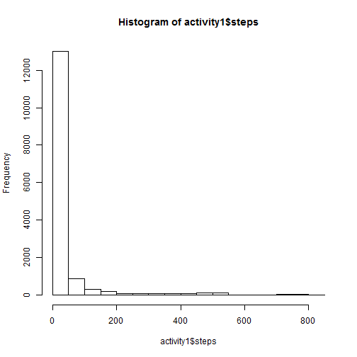
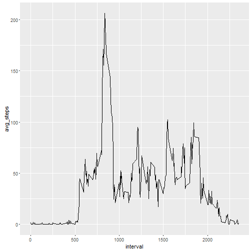
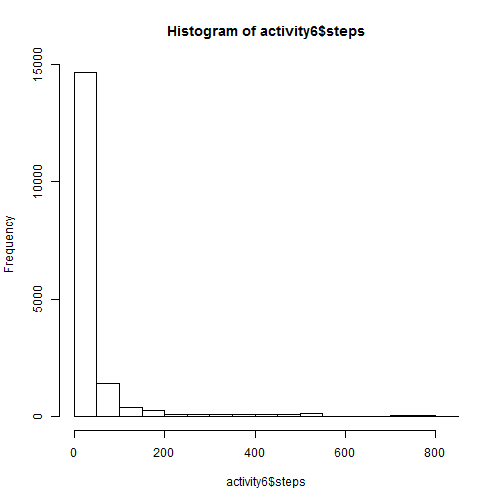
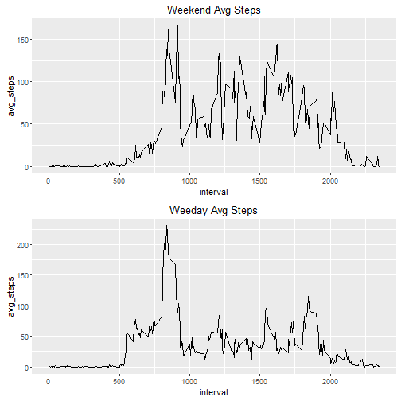

Reproducible Research: Peer Assessment 1
========================================


Loading and Preprocessing the Data


```r
#SETTING WORKING DIRECTORY
setwd("C:/Users/HerrinFamilyPC/Desktop/Coursera/Reproducible Research")

##Download data from https://github.com/rdpeng/RepData_PeerAssessment1/blob/master/activity.zip
##Drag activity.csv into your working directory

##Load the data
activity <- read.table("activity.csv", sep=",",header=T)
```

What is mean total number of steps taken per day

```r
#Calculate the total number of steps taken per day
sum(activity$steps, na.rm = TRUE)/61  # Total number of steps (ex-missing values) divided by 61 days
```

```
## [1] 9354.23
```

Histogram of total number of steps taken each day


```r
#First construct subset of activity containing only steps and date
activity1 <- activity[,1:2]
hist(activity1$steps)
```



Calculate and report the mean and median of the total number of steps taken per day


```r
#summary function will provide this info
summary(activity)
```

```
##      steps                date          interval     
##  Min.   :  0.00   2012-10-01:  288   Min.   :   0.0  
##  1st Qu.:  0.00   2012-10-02:  288   1st Qu.: 588.8  
##  Median :  0.00   2012-10-03:  288   Median :1177.5  
##  Mean   : 37.38   2012-10-04:  288   Mean   :1177.5  
##  3rd Qu.: 12.00   2012-10-05:  288   3rd Qu.:1766.2  
##  Max.   :806.00   2012-10-06:  288   Max.   :2355.0  
##  NA's   :2304     (Other)   :15840
```


What is the average daily activity pattern?

1. Make a time series plot (i.e. type = "l") of the 5-minute interval (x-axis) and the average number of steps taken, averaged across all days (y-axis)


```r
#First need a subset of activity cotaining average steps for each interval (across all days)
#use aggregate function to accomplish this
activity2 <- aggregate(activity$steps, by=list(activity$interval), FUN=mean, na.rm=TRUE)
names(activity2) = c("interval","avg_steps")
library(ggplot2)
```

```
## Warning: package 'ggplot2' was built under R version 3.1.3
```

```r
#now on to the plot
p1 <- ggplot(activity2, aes(x=interval, y=avg_steps)) + geom_line()
p1
```



2.Which 5-minute interval, on average across all the days in the dataset, contains the maximum number of steps?


```r
activity2[which.max(activity2[,2]),]
```

```
##     interval avg_steps
## 104      835  206.1698
```


IMPUTE MISSING VALUES

1.Calculate and report the total number of missing values in the dataset (i.e. the total number of rows with NAs)

```r
sum(is.na(activity[1]))
```

```
## [1] 2304
```

2.Devise a strategy for filling in all of the missing values in the dataset. The strategy does not need to be sophisticated. For example, you could use #the mean/median for that day, or the mean for that 5-minute interval, etc.


```r
#borrowed technique from stackoverflow for function to impute missing value
#http://stackoverflow.com/questions/20273070/function-to-impute-missing-value
require(plyr)
```

```
## Loading required package: plyr
```

```r
require(Hmisc)
```

```
## Loading required package: Hmisc
```

```
## Warning: package 'Hmisc' was built under R version 3.1.3
```

```
## Loading required package: lattice
```

```
## Loading required package: survival
```

```
## Loading required package: splines
```

```
## Loading required package: Formula
```

```
## Warning: package 'Formula' was built under R version 3.1.3
```

```
## 
## Attaching package: 'Hmisc'
```

```
## The following objects are masked from 'package:plyr':
## 
##     is.discrete, summarize
```

```
## The following objects are masked from 'package:base':
## 
##     format.pval, round.POSIXt, trunc.POSIXt, units
```

```r
activity3 <- ddply(activity, "interval", mutate, imputed.steps = impute(steps, mean))

activity4 <- activity3[,2:4]
names(activity4) <- c("date","interval","steps")
activity5 <- activity4[ , c(3,1,2)]
activity6 <- activity5[order(activity5$date, activity5$interval),]
```

4.Make a histogram of the total number of steps taken each day and 
Calculate and report the mean and median total number of steps taken per day. 
Do these values differ from the estimates from the first part of the assignment? 
What is the impact of imputing missing data on the estimates of the total daily number of steps?


```r
hist(activity6$steps)
```



```r
mean(activity6$steps)
```

```
## [1] 37.3826
```

```r
median(activity6$steps)
```

```
## [1] 0
```

```r
#Total Number of Steps Taken per Day
sum(activity6$steps)/61
```

```
## [1] 10766.19
```

As compared to the first part of the assignment, mean and median remain the same.
Total steps per day skewed higher given that the avg of each interval's steps were imputed in place of the missing values rather than simply removing them.


Are there differences in activity patterns between weekdays and weekends?

For this part the weekdays() function may be of some help here. Use the dataset with the filled-in missing values for this part.


1. Create a new factor variable in the dataset with two levels - "weekday" and "weekend" indicating whether a given date is a weekday or weekend day.


```r
activity6$dayweek <- weekdays(as.Date(activity6$date))

activity6$weekday <- ifelse(activity6$dayweek %in% c("Saturday","Sunday"),"Weekend","Weekday")
```

2. Make a panel plot containing a time series plot (i.e. type = "l") of the 5-minute interval (x-axis) and the average number of steps taken, averaged across all weekday days or weekend days (y-axis). See the README file in the GitHub repository to see an example of what this plot should look like using simulated data.


```r
#First, need a subset of all weekend days and all weekdays
activity7 <- activity6[activity6$weekday == "Weekend",]
activity8 <- activity6[activity6$weekday == "Weekday",]


#Second need a subset of activity cotaining average steps for each interval (across all days)
#use aggregate function to accomplish this
activity9 <- aggregate(activity7$steps, by=list(activity7$interval), FUN=mean, na.rm=TRUE)
names(activity9) = c("interval","avg_steps") # weekend

activity10 <- aggregate(activity8$steps, by=list(activity8$interval), FUN=mean, na.rm=TRUE)
names(activity10) = c("interval","avg_steps") # weekday

#3rd, on to plots
p2 <- ggplot(activity9, aes(x=interval, y=avg_steps)) + geom_line() + ggtitle("Weekend Avg Steps")

p3 <- ggplot(activity10, aes(x=interval, y=avg_steps)) + geom_line() + ggtitle("Weeday Avg Steps")


#construct multiplot function from R Cookbook
# From R Cookbook 2/7/16 2300 PST
#http://www.cookbook-r.com/Graphs/Multiple_graphs_on_one_page_(ggplot2)/
# Multiple plot function
#
# ggplot objects can be passed in ..., or to plotlist (as a list of ggplot objects)
# - cols:   Number of columns in layout
# - layout: A matrix specifying the layout. If present, 'cols' is ignored.
#
# If the layout is something like matrix(c(1,2,3,3), nrow=2, byrow=TRUE),
# then plot 1 will go in the upper left, 2 will go in the upper right, and
# 3 will go all the way across the bottom.
#
multiplot <- function(..., plotlist=NULL, file, cols=1, layout=NULL) {
  library(grid)
  
  # Make a list from the ... arguments and plotlist
  plots <- c(list(...), plotlist)
  
  numPlots = length(plots)
  
  # If layout is NULL, then use 'cols' to determine layout
  if (is.null(layout)) {
    # Make the panel
    # ncol: Number of columns of plots
    # nrow: Number of rows needed, calculated from # of cols
    layout <- matrix(seq(1, cols * ceiling(numPlots/cols)),
                     ncol = cols, nrow = ceiling(numPlots/cols))
  }
  
  if (numPlots==1) {
    print(plots[[1]])
    
  } else {
    # Set up the page
    grid.newpage()
    pushViewport(viewport(layout = grid.layout(nrow(layout), ncol(layout))))
    
    # Make each plot, in the correct location
    for (i in 1:numPlots) {
      # Get the i,j matrix positions of the regions that contain this subplot
      matchidx <- as.data.frame(which(layout == i, arr.ind = TRUE))
      
      print(plots[[i]], vp = viewport(layout.pos.row = matchidx$row,
                                      layout.pos.col = matchidx$col))
    }
  }
}


# Now call multiplot for plots p2 and p3
multiplot(p2,p3)
```




